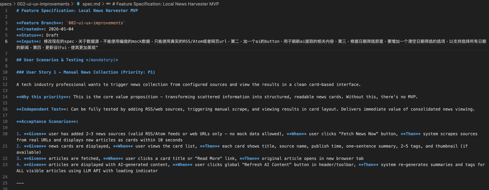
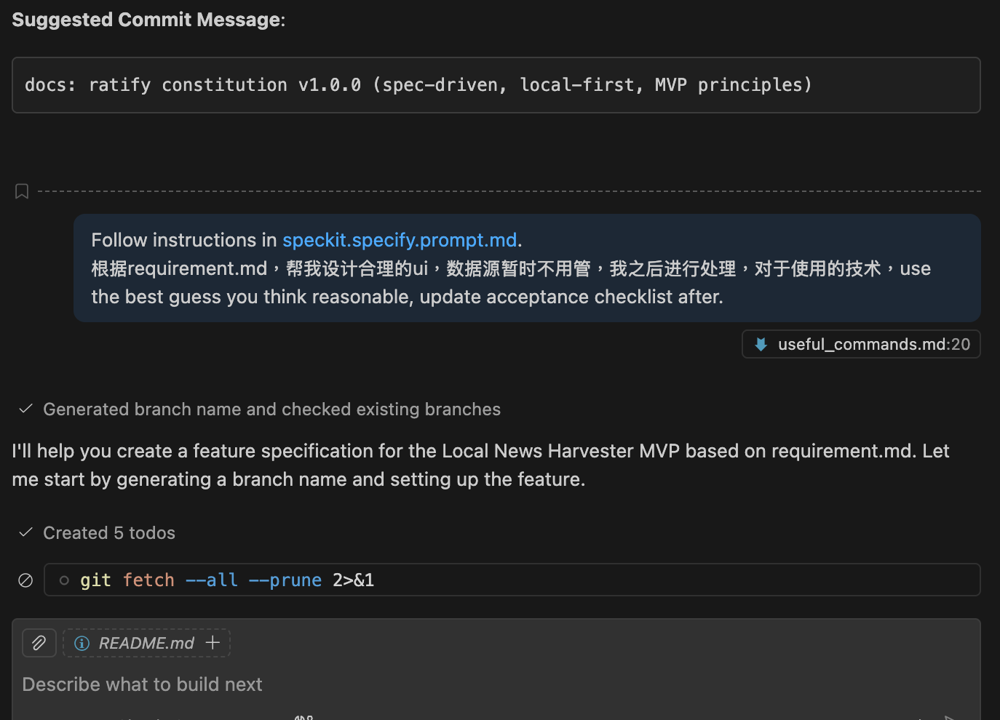
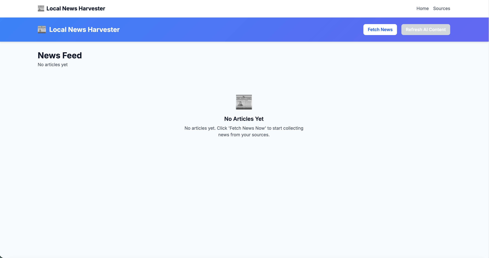
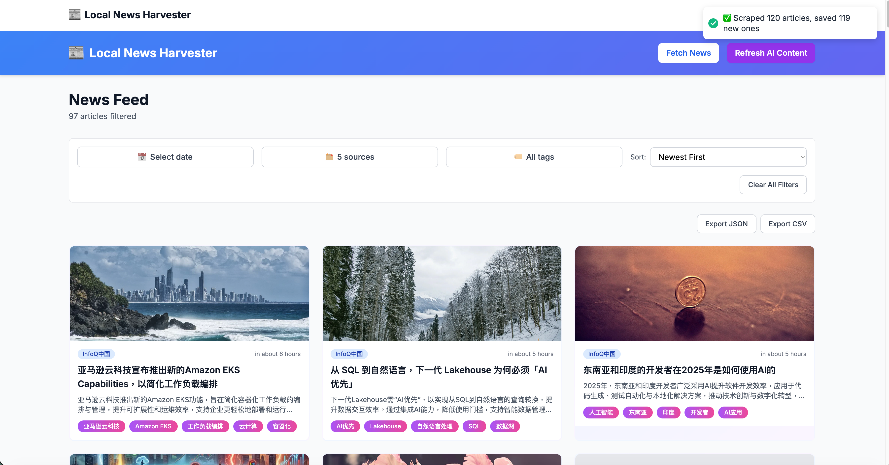
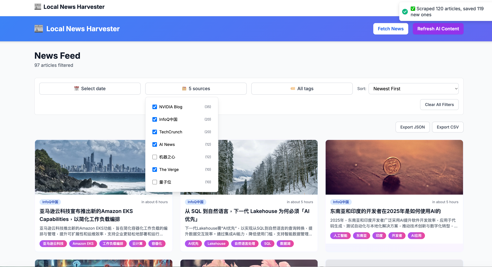
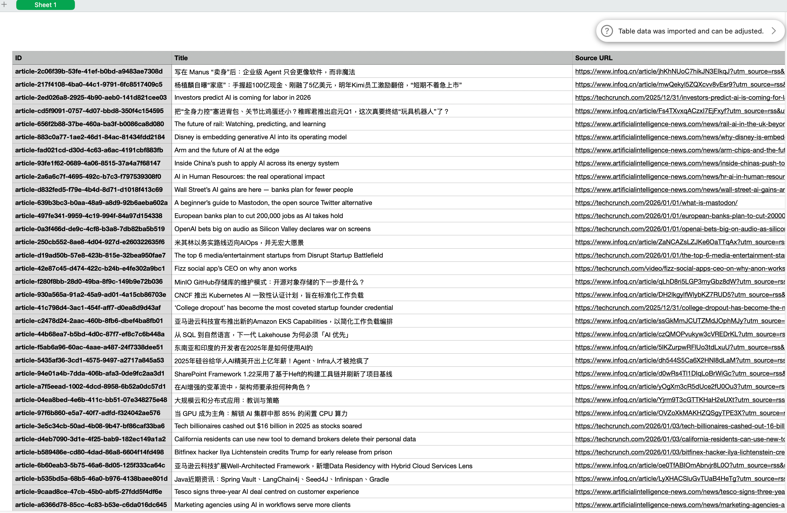

# Local News Harvester MVP

A Next.js application for collecting, filtering, and exporting news from multiple RSS feeds and web sources.

---

## 📦 交付物说明（Deliverables）

本项目完整包含以下四项交付物，满足面试要求：

### 交付物 A：技术规格说明书（The Spec）

✅ **已包含在项目中**

规格文档位于 `specs/` 目录，采用 Spec-Driven Development 开发范式：

- 📁 **主规格**: [`specs/002-ui-ux-improvements/spec.md`](specs/002-ui-ux-improvements/spec.md)
- 📄 **数据模型**: [`specs/002-ui-ux-improvements/data-model.md`](specs/002-ui-ux-improvements/data-model.md)  
- 📋 **开发计划**: [`specs/002-ui-ux-improvements/plan.md`](specs/002-ui-ux-improvements/plan.md)
- ✅ **任务清单**: [`specs/002-ui-ux-improvements/tasks.md`](specs/002-ui-ux-improvements/tasks.md)

规格文档包含：
- Data Models（NewsItem、Source、Tag、UserState 等完整 Schema）
- 抓取与去重策略（URL 规范化 + Levenshtein 算法，85% 阈值）
- API Interface 定义（所有路由端点与数据契约）
- UI 组件层级描述（页面/组件树结构图）

---

### 交付物 B：源代码与运行指南（Source Code）

✅ **可在本地一键启动**

**快速开始**（3 步）：

```bash
# 1. 克隆仓库
git clone https://github.com/cantaible/tiktok-interview.git
cd tiktok-interview

# 2. 安装依赖
npm install

# 3. 启动项目（首次运行会自动初始化数据库）
npm run dev
```

**首次运行时会自动**：
- ✅ 创建 SQLite 数据库（`data/news.db`）
- ✅ 启动开发服务器在 http://localhost:3000

控制台会显示：
```
🔧 Database not found, initializing...
✅ Database initialized with 10 news sources
```

**（可选）配置 AI 功能**：

如需 AI 生成摘要和标签（使用阿里云百炼 API）：

```bash
# 复制配置文件
cp .env.local.example .env.local

# 编辑 .env.local 添加 API Key
# DASHSCOPE_API_KEY=sk-your-api-key-here
```

> **注意**：没有 API Key 应用仍可正常工作，只是不会生成 AI 摘要和标签。

**验证安装**：

访问 http://localhost:3000，你应该看到：
1. 主页面显示新闻列表（初始为空）
2. 点击 **"Fetch News"** 抓取新闻
3. 等待几秒钟，会显示从 10 个新闻源抓取的文章
4. 可以使用日期、来源、标签进行筛选

---

### 交付物 C：开发复盘报告（Process Documentation）

📄 **查看完整复盘报告**: [PROCESS_DOCUMENTATION.md](PROCESS_DOCUMENTATION.md)

**报告概要**：
- 🛠 **开发工具**: VSCode + GitHub Copilot (Claude Sonnet 4.5)
- 📋 **开发方法**: Spec-Driven Development（参考 GitHub spec-kit）
- 🔄 **迭代流程**: Constitution → Specification → Clarification → Plan → Tasks → Implement
- 🐛 **关键修正案例**:
  - 案例 1：通过完善 Spec 修正 AI 编造数据源问题
  - 案例 2：通过明确规则解决日期筛选语义不一致

点击上方链接查看详细的开发过程、AI 协作方式与纠错案例。

---

### 交付物 D：运行证据（Proof of Work）

📸 **截图展示**（保存在 `screenshots/` 目录）：

#### 1. Spec 编写界面截图


#### 2. AI 工具生成代码过程截图  


#### 3. App 运行成功界面截图


#### 4. 新闻抓取结果展示


#### 5. 筛选功能


#### 6. 导出功能


---

## Features

- 📰 **Manual News Collection**: Fetch news from configured RSS feeds and web pages
- 🔍 **Advanced Filtering**: Filter articles by date, source, and tags with instant search
- 🏷️ **Smart Organization**: Auto-generated summaries and tags (LLM integration ready)
- 📊 **Source Management**: Add, enable/disable, and monitor news sources
- 💾 **Data Export**: Export filtered articles in JSON or CSV formats
- 🎨 **Modern UI**: Responsive card-based interface built with Tailwind CSS

## Tech Stack

- **Framework**: Next.js 14 (App Router)
- **Language**: TypeScript 5.3+
- **Database**: SQLite (better-sqlite3)
- **Styling**: Tailwind CSS 3.4
- **Scraping**: rss-parser, cheerio
- **LLM**: Aliyun Bailian (optional)

## Prerequisites

- Node.js 18+ 
- npm or yarn

## Installation

1. **Clone the repository**:
   ```bash
   git clone <repository-url>
   cd tiktok-interview
   ```

2. **Install dependencies**:
   ```bash
   npm install
   ```

3. **Start the development server** (database will be auto-initialized):
   ```bash
   npm run dev
   ```
   
   The database will be automatically created on first run with default news sources.

4. **(Optional) Configure AI features**:
   ```bash
   cp .env.local.example .env.local
   # Edit .env.local and add your DASHSCOPE_API_KEY
   ```
   
   Without API key, the app works normally but AI-generated summaries and tags will not be available.

## Usage

### Running the Application

1. **Start the development server**:
   ```bash
   npm run dev
   ```

2. **Access the application**:
   - Open your browser and navigate to: **http://localhost:3000**
   - The homepage displays the news article list

3. **Basic workflow**:
   - **View Articles**: Browse articles on the homepage with filters
   - **Collect News**: Click "Collect News" button to scrape from enabled sources
   - **Filter Content**: Use date picker, source checkboxes, or tag cloud to filter
   - **Manage Sources**: Navigate to "Manage Sources" page to add/edit news sources
   - **Export Data**: Click "Export" button and choose JSON or CSV format

4. **Stop the server**:
   - Press `Ctrl+C` in the terminal

### Quick Start Guide

For first-time users:

```bash
# 1. Install dependencies
npm install

# 2. Initialize database with sample data
npm run db:seed

# 3. (Optional) Configure LLM for AI summaries
./setup-llm.sh

# 4. Start the app
npm run dev

# 5. Open browser at http://localhost:3000
```

### Production Deployment

For production use:

```bash
# Build the application
npm run build

# Start production server
npm start

# Access at http://localhost:3000
```

## Available Scripts

- `npm run dev` - Start development server at http://localhost:3000
- `npm run build` - Build for production
- `npm start` - Start production server
- `npm run db:seed` - Initialize database with seed data
- `npm run type-check` - Run TypeScript type checking
- `npm run lint` - Run ESLint
- `npm run lint` - Run ESLint
- `npm run format` - Format code with Prettier
- `npm run type-check` - Check TypeScript types

## Project Structure

```
tiktok-interview/
├── app/                      # Next.js app directory
│   ├── api/                  # API routes
│   │   ├── articles/         # GET articles with filters
│   │   ├── scrape/           # POST scrape news sources
│   │   ├── sources/          # CRUD for news sources
│   │   └── export/           # Export articles
│   ├── sources/              # Source management page
│   ├── page.tsx              # Home page (news feed)
│   ├── layout.tsx            # Root layout
│   ├── error.tsx             # Error boundary
│   └── globals.css           # Global styles
├── components/               # React components
│   ├── ui/                   # Reusable UI components
│   ├── sources/              # Source management components
│   ├── FilterBar/            # Filter components
│   ├── NewsCard.tsx          # Article card display
│   ├── FilterBar.tsx         # Filter bar container
│   └── ExportButtons.tsx     # Export functionality
├── lib/                      # Business logic
│   ├── db/                   # Database layer
│   │   ├── schema.sql        # Database schema
│   │   ├── client.ts         # SQLite connection
│   │   ├── queries.ts        # Query functions
│   │   └── init.ts           # Database initialization
│   ├── scraper/              # News scraping
│   │   ├── rss-parser.ts     # RSS feed parser
│   │   ├── web-scraper.ts    # Web page scraper
│   │   └── deduplicator.ts   # Deduplication logic
│   ├── llm/                  # LLM integration
│   │   ├── bailian-client.ts # Aliyun Bailian wrapper
│   │   └── prompts.ts        # LLM prompts
│   └── export/               # Export utilities
│       ├── json-exporter.ts  # JSON export
│       └── csv-exporter.ts   # CSV export
├── types/                    # TypeScript types
│   ├── article.ts            # NewsArticle entity
│   ├── source.ts             # NewsSource entity
│   └── api.ts                # API contracts
└── data/                     # Data directory
    ├── news.db               # SQLite database (generated)
    ├── news-sources.json     # Seed data: sources
    └── news-articles.json    # Seed data: articles
```

## Database Schema

### Articles Table
- `id`: Unique identifier
- `title`: Article title
- `sourceURL`: Original article URL (unique)
- `sourceName`: Display name of source (indexed)
- `publishedAt`: Publication timestamp (indexed)
- `scrapedAt`: Scraping timestamp
- `summary`: LLM-generated summary (nullable)
- `tags`: JSON array of tags (nullable)
- `thumbnailURL`: Article image URL (nullable)
- `rawContent`: Full article text (nullable)

### Sources Table
- `id`: Unique identifier
- `sourceType`: "RSS" or "WEB"
- `url`: Feed/page URL (unique)
- `displayName`: User-friendly name
- `enabled`: Active status
- `lastScrapedAt`: Last successful scrape (nullable)
- `errorCount`: Consecutive failures

## API Endpoints

### GET /api/articles
Fetch articles with optional filters:
- `?date=YYYY-MM-DD` - Filter by date
- `?sources=source1,source2` - Filter by sources
- `?tags=tag1,tag2` - Filter by tags
- `?sort=newest|oldest` - Sort order
- `?limit=N` - Limit results
- `?path=stats` - Get statistics

### POST /api/scrape
Trigger news collection:
```json
{
  "enrichWithLLM": true
}
```

### GET /api/sources
List all news sources:
- `?enabled=true|false` - Filter by enabled status

### POST /api/sources
Add new source:
```json
{
  "sourceType": "RSS",
  "url": "https://example.com/feed.xml",
  "displayName": "Example News"
}
```

### PATCH /api/sources/:id
Update source enabled status:
```json
{
  "enabled": true
}
```

### DELETE /api/sources/:id
Delete a source

### GET /api/export
Export articles:
- `?format=json|csv` - Export format
- Accepts same filters as GET /api/articles

## Features in Detail

### News Collection
1. Fetches from enabled RSS feeds and web pages
2. Deduplicates by URL and title similarity (85% threshold)
3. Optionally enriches with LLM-generated summaries and tags
4. Saves new articles to database
5. Tracks source health (auto-disable after 3 failures)

### Filtering
- **Date**: Calendar picker to show articles from specific day
- **Sources**: Multi-select checkboxes with article counts
- **Tags**: Search and click tags in tag cloud
- **Sort**: Toggle between newest and oldest first
- **Clear**: One-click to remove all filters

### Source Management
- Add RSS feeds (auto-detects display name)
- Add web pages (manual display name)
- Enable/disable sources
- Monitor scraping status and errors
- Delete unused sources

### Data Export
- Export filtered articles to JSON or CSV
- Includes all metadata and relationships
- Filename includes export date
- CSV includes UTF-8 BOM for Excel compatibility

## Configuration

### LLM Configuration (Aliyun Bailian)

The project supports optional LLM enrichment for article summaries and tags using Aliyun Bailian API.

#### Quick Setup (Recommended)

Run the automated setup script:

```bash
./setup-llm.sh
```

The script will:
1. Prompt for your Aliyun Bailian API Key
2. Prompt for your Workspace ID
3. Create `.env.local` with proper configuration
4. Verify the configuration

#### Manual Setup

**Step 1: Obtain API Credentials**

1. Visit [Aliyun Bailian Console](https://bailian.console.aliyun.com/)
2. Create an account or log in
3. Navigate to API Management → API Keys
4. Create a new API key and copy it
5. Note your Workspace ID (found in workspace settings)

**Step 2: Configure Environment Variables**

Create `.env.local` in the project root:

```bash
# Copy from example
cp .env.local.example .env.local

# Edit and add your credentials
ALIYUN_BAILIAN_API_KEY=sk-xxxxxxxxxxxxxxxxxxxxxx
ALIYUN_BAILIAN_WORKSPACE_ID=llm-xxxxxxxxxxxxxxxxxxxxxx
```

**Step 3: Restart Development Server**

```bash
npm run dev
```

#### Verification

When LLM is configured correctly, you'll see:
- Console log: `🤖 LLM enrichment enabled with Bailian API`
- During scraping: `🤖 Enriching 5 articles with LLM...`
- Articles will have AI-generated summaries (~100 chars) and relevant tags (2-5 tags)

#### Mock Mode vs Real API

**Mock Mode (Default)**
- **When**: No API key configured
- **Summary**: First 97 characters + "..."
- **Tags**: Extracted from article title (words as tags)
- **Cost**: Free
- **Speed**: Instant
- **Quality**: Basic

**Real API Mode**
- **When**: API key configured
- **Summary**: AI-generated, context-aware (100 chars)
- **Tags**: AI-extracted, semantically relevant (2-5 tags)
- **Cost**: ~¥0.01 per article (varies by model)
- **Speed**: 2-5 seconds per batch
- **Quality**: High

#### Troubleshooting

**LLM not activating?**
```bash
# Check if .env.local exists
ls -la .env.local

# Verify environment variables are loaded
npm run dev
# Look for "🤖 LLM enrichment enabled" in console
```

**Invalid API key error?**
- Verify key starts with `sk-`
- Check workspace ID starts with `llm-`
- Ensure account has sufficient credits
- Test key in Aliyun console first

**Performance issues?**
- LLM enrichment adds 2-5s to scraping
- Consider scraping with `enrichWithLLM: false` for faster imports
- Enable LLM only for important sources

For detailed documentation, see:
- `LLM_FEATURE_GUIDE.md` - Complete LLM implementation details
- `LLM_SETUP_GUIDE.md` - Step-by-step setup guide with Q&A

### Other Environment Variables

Without LLM configuration:
- Summary will be first 97 characters + "..."
- Tags will be extracted from article title
- All other features work normally

### Customization

**Tailwind Colors** (`tailwind.config.ts`):
```ts
colors: {
  primary: "#3B82F6",    // Blue
  secondary: "#6B7280",  // Gray
  success: "#10B981",    // Green
  error: "#EF4444",      // Red
}
```

**Deduplication Threshold** (`lib/scraper/deduplicator.ts`):
```ts
const SIMILARITY_THRESHOLD = 0.85; // 85%
```

**LLM Prompts** (`lib/llm/prompts.ts`):
```ts
export const SUMMARY_PROMPT = "...";
export const TAGS_PROMPT = "...";
```

## Performance

- **Filter Speed**: <500ms for 500 articles (client-side with useMemo)
- **Scraping**: ~2-5s per source (network dependent)
- **Database**: SQLite with indexes on sourceName and publishedAt
- **LLM**: Batch processing for enrichment (5 articles per batch)

## Browser Support

- Chrome/Edge 90+
- Firefox 88+
- Safari 14+

## License

MIT

## Author

Built for TikTok interview demonstration
