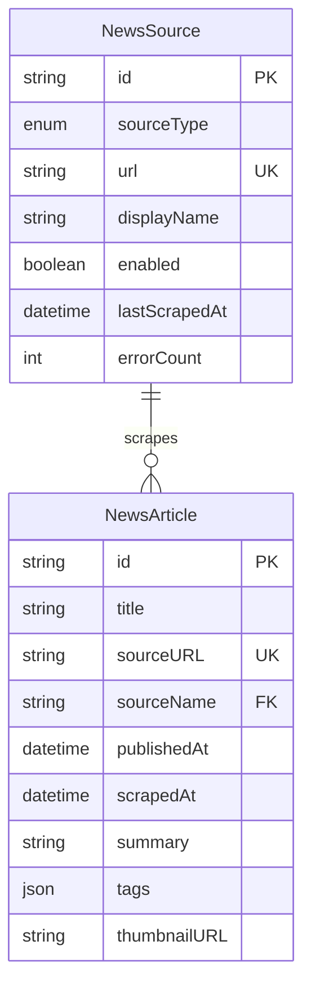

# Data Model: Local News Harvester MVP

**Purpose**: Define entity schemas and database structure  
**Date**: 2026-01-04  
**Related**: [spec.md](spec.md), [research.md](research.md)

## Entity Schemas

### NewsArticle

Represents a single news article fetched from RSS/web sources.

| Field | Type | Constraints | Description |
|-------|------|-------------|-------------|
| `id` | TEXT | PRIMARY KEY, NOT NULL | UUID v4 (e.g., "article-001") |
| `title` | TEXT | NOT NULL | Article headline (max 500 chars) |
| `sourceURL` | TEXT | UNIQUE, NOT NULL | Original article URL (deduplication key) |
| `sourceName` | TEXT | NOT NULL, INDEX | Display name (e.g., "机器之心", "TechCrunch") |
| `publishedAt` | TEXT | NOT NULL, INDEX | ISO 8601 datetime (e.g., "2026-01-04T10:30:00Z") |
| `scrapedAt` | TEXT | NOT NULL | ISO 8601 datetime of fetch operation |
| `summary` | TEXT | NULLABLE | LLM-generated one-sentence summary (max 100 chars), NULL if LLM failed |
| `tags` | TEXT | NULLABLE | JSON array as string (e.g., '["OpenAI","GPT-5","AI"]'), NULL if LLM failed |
| `thumbnailURL` | TEXT | NULLABLE | Image URL from RSS/og:image, NULL if unavailable |
| `rawContent` | TEXT | NULLABLE | Optional HTML/text excerpt for future search (Phase 2+) |

**Indexes**:
- `idx_publishedAt` on `publishedAt DESC` - Fast date range queries
- `idx_sourceName` on `sourceName` - Fast source filtering

**Sample Row**:
```json
{
  "id": "article-001",
  "title": "OpenAI发布GPT-5：推理能力大幅提升，支持多模态输入",
  "sourceURL": "https://openai.com/blog/gpt-5-announcement",
  "sourceName": "OpenAI Blog",
  "publishedAt": "2026-01-04T08:00:00Z",
  "scrapedAt": "2026-01-04T09:45:00Z",
  "summary": "OpenAI正式发布GPT-5模型，在推理、数学和编程能力上较GPT-4提升显著，新增视频理解功能。",
  "tags": "[\"OpenAI\",\"GPT-5\",\"大模型\",\"多模态\",\"AI\"]",
  "thumbnailURL": "https://images.unsplash.com/photo-1677442136019-21780ecad995?w=400",
  "rawContent": null
}
```

---

### NewsSource

Represents a configured news source (RSS feed or web URL).

| Field | Type | Constraints | Description |
|-------|------|-------------|-------------|
| `id` | TEXT | PRIMARY KEY, NOT NULL | UUID v4 (e.g., "source-001") |
| `sourceType` | TEXT | NOT NULL, CHECK IN ('RSS', 'WEB') | Source category |
| `url` | TEXT | UNIQUE, NOT NULL | RSS feed URL or web page URL |
| `displayName` | TEXT | NOT NULL | User-friendly name shown in UI |
| `enabled` | INTEGER | NOT NULL, DEFAULT 1 | Boolean (1=enabled, 0=disabled) |
| `lastScrapedAt` | TEXT | NULLABLE | ISO 8601 datetime of last successful scrape, NULL if never scraped |
| `errorCount` | INTEGER | NOT NULL, DEFAULT 0 | Consecutive scraping failures (reset to 0 on success) |

**Business Rules**:
- Auto-disable source if `errorCount >= 3` (reliability threshold)
- `displayName` auto-detected from RSS `<title>` or user-provided for WEB sources

**Sample Row**:
```json
{
  "id": "source-001",
  "sourceType": "RSS",
  "url": "https://www.jiqizhixin.com/rss",
  "displayName": "机器之心",
  "enabled": 1,
  "lastScrapedAt": "2026-01-04T10:30:00Z",
  "errorCount": 0
}
```

---

### UserPreferences (Optional - Future Enhancement)

Stores UI state and user settings. **MVP: Use browser localStorage, not database.**

| Field | Type | Description |
|-------|------|-------------|
| `activeFilters` | JSON | `{ date: "2026-01-04", sources: ["机器之心"], tags: ["AI"] }` |
| `sortOrder` | TEXT | "newest" or "oldest" |
| `viewMode` | TEXT | "grid" or "list" (future) |

**Implementation**: Client-side only, persisted via `window.localStorage`.

---

## Database Schema (SQLite)

```sql
-- File: lib/db/schema.sql

CREATE TABLE IF NOT EXISTS articles (
  id TEXT PRIMARY KEY NOT NULL,
  title TEXT NOT NULL,
  sourceURL TEXT UNIQUE NOT NULL,
  sourceName TEXT NOT NULL,
  publishedAt TEXT NOT NULL,
  scrapedAt TEXT NOT NULL,
  summary TEXT,
  tags TEXT,  -- JSON array stored as string
  thumbnailURL TEXT,
  rawContent TEXT
);

CREATE INDEX IF NOT EXISTS idx_publishedAt ON articles(publishedAt DESC);
CREATE INDEX IF NOT EXISTS idx_sourceName ON articles(sourceName);

CREATE TABLE IF NOT EXISTS sources (
  id TEXT PRIMARY KEY NOT NULL,
  sourceType TEXT NOT NULL CHECK(sourceType IN ('RSS', 'WEB')),
  url TEXT UNIQUE NOT NULL,
  displayName TEXT NOT NULL,
  enabled INTEGER NOT NULL DEFAULT 1,
  lastScrapedAt TEXT,
  errorCount INTEGER NOT NULL DEFAULT 0
);

-- Seed data (development only)
INSERT OR IGNORE INTO sources (id, sourceType, url, displayName, enabled, lastScrapedAt, errorCount) VALUES
  ('source-001', 'RSS', 'https://www.jiqizhixin.com/rss', '机器之心', 1, NULL, 0),
  ('source-002', 'RSS', 'https://www.qbitai.com/feed', '量子位', 1, NULL, 0),
  ('source-003', 'RSS', 'https://techcrunch.com/feed/', 'TechCrunch', 1, NULL, 0);
```

---

## TypeScript Type Definitions

```typescript
// types/article.ts

export interface NewsArticle {
  id: string;
  title: string;
  sourceURL: string;
  sourceName: string;
  publishedAt: string; // ISO 8601
  scrapedAt: string;   // ISO 8601
  summary: string | null;
  tags: string[] | null; // Parsed from JSON string
  thumbnailURL: string | null;
  rawContent?: string | null;
}

export interface NewsArticleRow {
  // Database row format (tags as JSON string)
  id: string;
  title: string;
  sourceURL: string;
  sourceName: string;
  publishedAt: string;
  scrapedAt: string;
  summary: string | null;
  tags: string | null; // JSON string: '["tag1","tag2"]'
  thumbnailURL: string | null;
  rawContent: string | null;
}

export function rowToArticle(row: NewsArticleRow): NewsArticle {
  return {
    ...row,
    tags: row.tags ? JSON.parse(row.tags) : null
  };
}
```

```typescript
// types/source.ts

export interface NewsSource {
  id: string;
  sourceType: 'RSS' | 'WEB';
  url: string;
  displayName: string;
  enabled: boolean;
  lastScrapedAt: string | null; // ISO 8601
  errorCount: number;
}

export interface NewsSourceRow {
  // Database row format (enabled as INTEGER)
  id: string;
  sourceType: 'RSS' | 'WEB';
  url: string;
  displayName: string;
  enabled: number; // SQLite boolean: 1 or 0
  lastScrapedAt: string | null;
  errorCount: number;
}

export function rowToSource(row: NewsSourceRow): NewsSource {
  return {
    ...row,
    enabled: row.enabled === 1
  };
}
```

---

## Relationships



**Notes**:
- `NewsArticle.sourceName` is a **soft foreign key** (no SQL FOREIGN KEY constraint) to `NewsSource.displayName`
- Allows articles to persist even if source is deleted (denormalized for simplicity)

---

## Data Validation Rules

### Article Validation
```typescript
// lib/db/validators.ts

export function validateArticle(article: Partial<NewsArticle>): string[] {
  const errors: string[] = [];
  
  if (!article.title || article.title.length > 500) {
    errors.push('Title must be 1-500 characters');
  }
  
  if (!article.sourceURL || !isValidURL(article.sourceURL)) {
    errors.push('Invalid sourceURL');
  }
  
  if (!article.publishedAt || !isISO8601(article.publishedAt)) {
    errors.push('publishedAt must be ISO 8601 format');
  }
  
  if (article.summary && article.summary.length > 100) {
    errors.push('Summary must be ≤100 characters');
  }
  
  if (article.tags && (article.tags.length < 2 || article.tags.length > 5)) {
    errors.push('Tags must be 2-5 items');
  }
  
  return errors;
}
```

### Source Validation
```typescript
export function validateSource(source: Partial<NewsSource>): string[] {
  const errors: string[] = [];
  
  if (!source.url || !isValidURL(source.url)) {
    errors.push('Invalid URL');
  }
  
  if (!source.sourceType || !['RSS', 'WEB'].includes(source.sourceType)) {
    errors.push('sourceType must be RSS or WEB');
  }
  
  if (!source.displayName || source.displayName.trim().length === 0) {
    errors.push('displayName is required');
  }
  
  return errors;
}
```

---

## Query Patterns

### Common Queries
```typescript
// lib/db/queries.ts

export function getArticles(filters?: {
  date?: string;       // "2026-01-04"
  sources?: string[];  // ["机器之心", "TechCrunch"]
  tags?: string[];     // ["AI", "OpenAI"]
  limit?: number;
}): NewsArticle[] {
  let query = 'SELECT * FROM articles WHERE 1=1';
  const params: any[] = [];
  
  if (filters?.date) {
    query += ' AND DATE(publishedAt) = ?';
    params.push(filters.date);
  }
  
  if (filters?.sources?.length) {
    const placeholders = filters.sources.map(() => '?').join(',');
    query += ` AND sourceName IN (${placeholders})`;
    params.push(...filters.sources);
  }
  
  if (filters?.tags?.length) {
    // JSON array contains check
    const tagConditions = filters.tags.map(() => 'tags LIKE ?').join(' OR ');
    query += ` AND (${tagConditions})`;
    params.push(...filters.tags.map(tag => `%"${tag}"%`));
  }
  
  query += ' ORDER BY publishedAt DESC';
  
  if (filters?.limit) {
    query += ' LIMIT ?';
    params.push(filters.limit);
  }
  
  const rows = db.prepare(query).all(...params) as NewsArticleRow[];
  return rows.map(rowToArticle);
}
```

---

## Migration Strategy

**MVP Approach**: No migrations needed. Schema creates on first run via `CREATE TABLE IF NOT EXISTS`.

**Future**: Use a migration library (node-pg-migrate, Prisma) if schema changes after production data exists.

---

**Status**: ✅ Data model complete  
**Next**: Generate API contracts in `/contracts` directory
