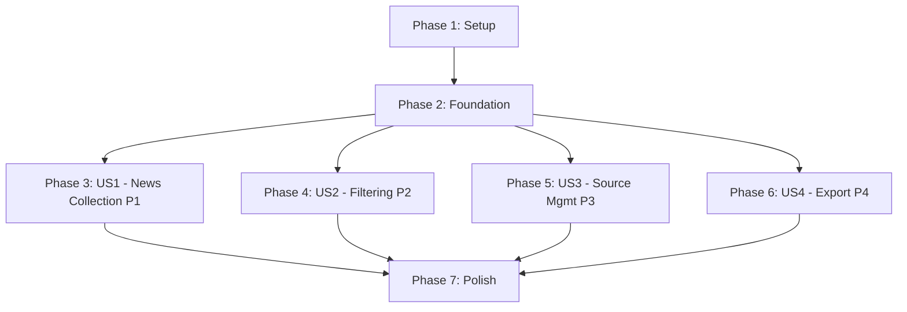

# Tasks: UI/UX Improvements v2

**Input**: Design documents from `/specs/002-ui-ux-improvements/`  
**Prerequisites**: plan.md ✓, spec.md ✓, research.md ✓, data-model.md ✓, contracts/ ✓

**Tests**: Not explicitly requested in feature specification - no test tasks generated.

**Organization**: Tasks are grouped by user story to enable independent implementation and testing of each story.

## Format: `[ID] [P?] [Story] Description`

- **[P]**: Can run in parallel (different files, no dependencies)
- **[Story]**: Which user story this task belongs to (e.g., US1, US2, US3)
- Include exact file paths in descriptions

## Path Conventions

- **Web app structure**: `app/`, `components/`, `lib/` at repository root
- Paths follow Next.js 14 App Router conventions

---

## Phase 1: Setup (Shared Infrastructure)

**Purpose**: Install dependencies and configure tooling for v2 enhancements

- [X] T001 Install react-hot-toast@2.4.1 dependency via `npm install react-hot-toast@2.4.1`
- [X] T002 [P] Update tailwind.config.ts with gradient colors (#3B82F6, #6366F1), glass effect colors, header-gradient backgroundImage, and xs backdrop-blur
- [X] T003 [P] Update app/globals.css with design token CSS variables for gradients and glassmorphism effects

---

## Phase 2: Foundational (Blocking Prerequisites)

**Purpose**: Core infrastructure that MUST be complete before user story implementation

**⚠️ CRITICAL**: No user story work can begin until this phase is complete

- [X] T004 Create lib/utils/localStorage.ts with saveFilterState(), loadFilterState(), and FILTER_STATE_KEY constant for filter persistence
- [X] T005 Create lib/hooks/useFilterState.ts custom hook with filters state, updateFilters(), clearFilters() functions, localStorage integration
- [X] T006 [P] Add Toaster component from react-hot-toast to app/layout.tsx with position="top-right" and custom styling (4s duration, white background)
- [X] T007 [P] Create types/filters.ts with FilterState interface (dateRange, selectedSources, selectedTags, lastUpdated)

**Checkpoint**: Foundation ready - user story implementation can now begin in parallel

---

## Phase 3: User Story 1 - Manual News Collection (Priority: P1) 🎯 MVP

**Goal**: Enable users to trigger news collection from real sources and view results with AI-powered summaries. Add global AI refresh button for batch regeneration.

**Independent Test**: Add RSS sources, click "Fetch News", verify cards display. Click global "Refresh AI Content" button, verify batch processing with progress bar works.

### Implementation for User Story 1

- [X] T008 [P] [US1] Create components/Header.tsx with gradient background (bg-header-gradient), logo, "Fetch News" button, and placeholder for AI refresh button
- [X] T009 [P] [US1] Create components/ui/ProgressBar.tsx with progress percentage prop, animated fill bar, and article count display (e.g., "15/47 articles")
- [X] T010 [P] [US1] Create components/AIRefreshButton.tsx with purple accent (#8B5CF6), loading state, progress bar integration, and cancel button
- [X] T011 [US1] Create app/api/ai-refresh/route.ts with POST handler (initiate batch), GET handler (poll progress), DELETE handler (cancel operation)
- [X] T012 [US1] Create lib/hooks/useAIRefresh.ts custom hook with startRefresh(), pollProgress(), cancelRefresh() functions, sessionId state management
- [X] T013 [US1] Update lib/llm/bailian-client.ts to add batchGenerateSummaries() function with abort signal support for cancellation
- [X] T014 [US1] Update lib/db/queries.ts to add batchUpdateArticleAI() function with SQLite transaction for atomic updates
- [X] T015 [US1] Integrate AIRefreshButton component into components/Header.tsx next to "Fetch News" button
- [X] T016 [US1] Update app/page.tsx to add Header component with global AI refresh functionality, passing article IDs of displayed articles
- [X] T017 [US1] Update components/NewsCard.tsx with enhanced styling: gradient borders, 12px border-radius, 0 2px 8px shadow, hover lift effect (4px + shadow increase)
- [X] T018 [US1] Update components/NewsCard.tsx to add color-coded tag chips with gradient backgrounds, rounded pill shape (16px border-radius), and hover scale 1.05
- [X] T019 [US1] Add Toast notification to app/api/scrape/route.ts showing scraping result statistics (e.g., "3 sources fetched, 2 failed")

**Checkpoint**: At this point, User Story 1 should be fully functional - users can fetch news from real sources, view enhanced cards, and batch refresh AI content with progress tracking

---

## Phase 4: User Story 2 - News Discovery with Filtering (Priority: P2)

**Goal**: Enable users to filter news by date, source, and tags with individual clear buttons and persistent filter state

**Independent Test**: Pre-populate articles, apply date/source/tag filters, verify cards update. Refresh browser, verify filters persist. Click individual [×] buttons, verify filters clear individually.

### Implementation for User Story 2

- [X] T020 [P] [US2] Create components/FilterBar/DatePicker.tsx with date range selection, active date badge display, and [×] clear button
- [X] T021 [P] [US2] Create components/FilterBar/SourceFilter.tsx with checkbox list, "N Sources" badge when active, article counts per source, and [×] clear button
- [X] T022 [P] [US2] Create components/FilterBar/TagFilter.tsx with tag cloud/chips, search input, individual [×] buttons per tag, and color-coded active state
- [ ] T023 [US2] Create components/FilterBar/index.tsx main container that orchestrates DatePicker, SourceFilter, TagFilter sub-components with useFilterState hook integration
- [ ] T024 [US2] Add "Clear All Filters" button to components/FilterBar/index.tsx that calls clearFilters() and hides all badges
- [ ] T025 [US2] Add "Reset to Default" button to components/FilterBar/index.tsx that clears localStorage filter state via localStorage.removeItem()
- [ ] T026 [US2] Update app/api/articles/route.ts to accept query parameters (dateFrom, dateTo, sources, tags) and call getFilteredArticles() from lib/db/queries.ts
- [ ] T027 [US2] Update lib/db/queries.ts to add getFilteredArticles() function with date range, source IN clause, and tag LIKE filtering using existing indexes
- [ ] T028 [US2] Add active filter badges row to app/page.tsx that only displays when filters are applied, showing date badge, sources badge, and tag chips with [×] buttons
- [ ] T029 [US2] Update app/page.tsx to integrate FilterBar component above news card grid, passing filter state and handlers
- [ ] T030 [US2] Update components/FilterBar styles with glassmorphism effect (backdrop-blur-sm, bg-glass-bg, border-glass-border)
- [ ] T031 [US2] Add filter badge color coding: Date badges (#3B82F6 blue), Source badges (#10B981 green), Tag chips (#8B5CF6 purple)
- [ ] T032 [US2] Implement client-side filter performance optimization ensuring <500ms response time for 500 articles

**Checkpoint**: At this point, User Story 2 should be fully functional - users can filter by date/source/tags, see color-coded badges, clear filters individually or all at once, and filter state persists across browser sessions

---

## Phase 5: User Story 3 - News Source Management (Priority: P3)

**Goal**: Enable users to add, remove, and manage news sources with error tracking

**Independent Test**: Navigate to Settings/Sources page, add RSS/web URL, verify source appears in list. Delete source, verify confirmation dialog and removal.

### Implementation for User Story 3

- [ ] T033 [P] [US3] Create components/SourceManager.tsx with form for adding RSS/web URLs, validation (URL format check), and modern styling
- [ ] T034 [P] [US3] Add source list display to components/SourceManager.tsx showing source name, URL, type (RSS/WEB), enabled status, last scraped timestamp, and error count
- [ ] T035 [US3] Add delete button with confirmation dialog to components/SourceManager.tsx using browser confirm() or custom modal component
- [ ] T036 [US3] Update lib/db/queries.ts to add getAllSources() function that returns all sources with error statistics
- [ ] T037 [US3] Update lib/db/mutations.ts to add addSource(), deleteSource(), and updateSourceError() functions
- [ ] T038 [US3] Update app/api/sources/route.ts to add POST handler (add source), DELETE handler (remove source), and GET handler (list all sources with stats)
- [ ] T039 [US3] Add red error icon indicator to source list items in components/SourceManager.tsx when errorCount > 0
- [ ] T040 [US3] Create app/settings/page.tsx (or similar route) and integrate SourceManager component
- [ ] T041 [US3] Add first-startup detection in lib/db/init.ts to auto-scrape 6 articles per source when articles table is empty (implements FR-030 auto-fetch requirement)

**Checkpoint**: At this point, User Story 3 should be fully functional - users can add/remove sources, see error tracking, and manage their source list. First-time users see 20-30 pre-loaded articles.

---

## Phase 6: User Story 4 - Data Export (Priority: P4)

**Goal**: Enable users to export filtered news data to JSON or CSV formats

**Independent Test**: Display news cards (filtered or unfiltered), click "Export as JSON", verify downloaded file contains correct data. Repeat for CSV format.

### Implementation for User Story 4

- [ ] T042 [P] [US4] Create lib/utils/export.ts with exportToJSON() function that converts article array to JSON string and triggers browser download
- [ ] T043 [P] [US4] Add exportToCSV() function to lib/utils/export.ts with proper CSV escaping, header row, and UTF-8 BOM for Excel compatibility
- [ ] T044 [US4] Create components/ExportButtons.tsx with styled JSON and CSV export buttons, download icons, and click animations
- [ ] T045 [US4] Add ExportButtons component to app/page.tsx footer area, passing currently displayed (filtered) articles as prop
- [ ] T046 [US4] Implement download trigger using Blob API and <a download> approach or FileSaver.js library if needed
- [ ] T047 [US4] Add export success Toast notification after file download completes

**Checkpoint**: At this point, User Story 4 should be fully functional - users can export filtered or unfiltered news data to JSON/CSV files

---

## Phase 7: Polish & Cross-Cutting Concerns

**Purpose**: Final enhancements not tied to specific user stories

- [X] T048 [P] Remove lib/db/seed.ts file entirely (no longer needed with real RSS sources)
- [X] T049 [P] Delete data/news-articles.json mock data file (already removed)
- [X] T050 Update lib/db/init.ts to remove all mock article insertion logic (already completed)
- [X] T051 Update data/news-sources.json to contain ONLY real RSS sources (机器之心, 量子位, TechCrunch, The Verge, ArXiv CS, etc.)
- [ ] T052 [P] Add loading skeleton/shimmer effect to components/NewsCard.tsx for use during data fetching (implements FR-027)
- [ ] T053 [P] Add empty state component to app/page.tsx with friendly message when no articles match filters (implements FR-028)
- [X] T054 [P] Add .gitignore entry to permanently exclude data/news-articles.json from version control
- [ ] T055 [P] Ensure all interactive elements have keyboard navigation support (Tab order, Enter/Space activation)
- [ ] T056 [P] Add ARIA labels to FilterBar components and AIRefreshButton for screen reader accessibility
- [ ] T057 [P] Verify 4.5:1 contrast ratio for all text elements against backgrounds using browser DevTools
- [ ] T058 Update app/layout.tsx header section with gradient background matching design system
- [ ] T059 [P] Add smooth CSS transitions (0.3s cubic-bezier) to card hover effects, filter badge animations, and button interactions
- [ ] T060 Test responsive design at 375px (mobile), 768px (tablet), and 1920px (desktop) widths
- [ ] T061 Final manual testing: Complete full workflow (add source → fetch → filter → export) in under 5 minutes

---

## Implementation Strategy

### MVP-First Approach

The phases are ordered to deliver maximum value incrementally:

1. **Phase 1-2** (Setup + Foundation): Enable all subsequent work
2. **Phase 3** (US1 - P1): Core news collection + AI refresh = MVP v2.0
3. **Phase 4** (US2 - P2): Filtering UX = Major quality of life improvement
4. **Phase 5** (US3 - P3): Source management = Long-term usability
5. **Phase 6** (US4 - P4): Export = Power user feature
6. **Phase 7** (Polish): Final touches and compliance

**Suggested MVP v2.0 Scope**: Phases 1-3 only (Setup + Foundation + US1)
- Users can fetch news from real sources
- Enhanced card design with gradients and better styling
- Global AI refresh with batch processing and progress tracking
- Toast notifications for feedback
- **Estimated effort**: 1-2 weeks

**Subsequent releases**:
- **v2.1**: Add Phase 4 (US2 - Filtering with persistence) - 1 week
- **v2.2**: Add Phase 5 (US3 - Source management) - 3-5 days
- **v2.3**: Add Phase 6 (US4 - Export) - 2-3 days
- **v2.4**: Phase 7 (Polish) - 2-3 days

---

## Dependencies Between User Stories

**Key insights**:
- All user stories are **independent** after Foundation phase completes
- US1-US4 can be implemented in **parallel** by different developers
- No circular dependencies or blocking relationships between user stories
- Each user story delivers **standalone value** that can be tested independently

---

## Parallel Execution Examples

### After Foundation Phase (T001-T007) completes:

**Parallel Track A - US1 Team**: Implement T008-T019 (News Collection + AI Refresh)
**Parallel Track B - US2 Team**: Implement T020-T032 (Filtering UX)
**Parallel Track C - US3 Team**: Implement T033-T040 (Source Management)
**Parallel Track D - US4 Team**: Implement T041-T046 (Export)

### Within User Story 1 (Example):

- **T008, T009, T010** can run in parallel (different component files)
- **T011** must complete before **T012** (API route needed for hook)
- **T013, T014** can run in parallel with **T011** (different modules)
- **T017, T018** can run in parallel (independent NewsCard enhancements)

### Within Foundation Phase:

- **T002, T003, T006, T007** can all run in parallel (different config/type files)
- **T004** should complete before **T005** (hook depends on localStorage utils)

---

## Task Summary

| Phase | User Story | Task Count | Estimated Effort | Dependencies |
|-------|------------|------------|------------------|--------------|
| Phase 1 | Setup | 3 | 1-2 hours | None |
| Phase 2 | Foundation | 4 | 4-6 hours | Phase 1 |
| Phase 3 | US1 (P1) | 12 | 2-3 days | Phase 2 |
| Phase 4 | US2 (P2) | 13 | 2-3 days | Phase 2 |
| Phase 5 | US3 (P3) | 9 | 1-2 days | Phase 2 |
| Phase 6 | US4 (P4) | 6 | 1 day | Phase 2 |
| Phase 7 | Polish | 14 | 2-3 days | All phases |
| **Total** | - | **61 tasks** | **10-15 days** | - |

---

## Format Validation

✅ All tasks follow required checklist format:
- `- [ ]` checkbox prefix
- `[Txxx]` sequential task ID
- `[P]` marker for parallelizable tasks (different files, no dependencies)
- `[USx]` story label for user story phases (US1, US2, US3, US4)
- Description with exact file path

✅ Task organization:
- Phase 1: Setup (no story labels)
- Phase 2: Foundation (no story labels)
- Phases 3-6: User Stories with [USx] labels
- Phase 7: Polish (no story labels)

✅ Each user story phase includes:
- Story goal statement
- Independent test criteria
- Implementation tasks with file paths
- Checkpoint for verification

✅ No test tasks generated (not explicitly requested in spec)
