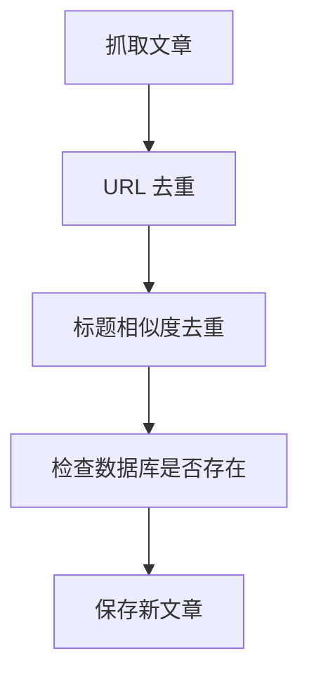

# 去重功能实现与测试指南

## 📋 功能概述

系统实现了**两层去重机制**：

### 1. URL 去重 (deduplicateByURL)
**目的**: 防止相同文章因为 URL 变体而重复

**实现位置**: `lib/scraper/deduplicator.ts`

**算法**:
```typescript
function normalizeURL(url: string): string {
  // 1. 移除追踪参数 (utm_source, utm_medium, utm_campaign, ref, source)
  // 2. 移除尾部斜杠
  // 3. 移除 www 前缀
  // 返回规范化的 URL
}
```

**示例**:
```
原始 URL 1: https://www.example.com/article?utm_source=twitter
原始 URL 2: https://example.com/article/
规范化后:   https://example.com/article

✅ 判定为重复，只保留第一个
```

---

### 2. 标题相似度去重 (deduplicateByTitle)
**目的**: 防止同一新闻以不同标题被多个源报道

**实现位置**: `lib/scraper/deduplicator.ts`

**算法**: 
- 使用 **Levenshtein 编辑距离** 计算相似度
- 阈值: **85%** (threshold = 0.85)
- 库: `fastest-levenshtein`

**相似度计算公式**:
```typescript
similarity = 1 - (editDistance / maxLength)
```

**示例**:
```
标题 1: "OpenAI releases GPT-4 Turbo with 128K context"
标题 2: "OpenAI Releases GPT-4 Turbo With 128k Context"
相似度: 95.8% > 85%

✅ 判定为重复，只保留第一个
```

---

## 🔄 执行流程



**代码位置**: `app/api/scrape/route.ts`

```typescript
// 1. 抓取所有源
const allArticles = [...articles from all sources];

// 2. 两层去重
const uniqueArticles = deduplicate(allArticles);
// 内部调用:
// - deduplicateByURL(articles)
// - deduplicateByTitle(afterURLDedup)

// 3. 数据库去重
const newArticles = uniqueArticles.filter(article => 
  !getArticleByUrl(article.sourceURL)
);

// 4. 保存
newArticles.forEach(saveArticle);
```

---

## 🧪 测试方法

### 方法 1: 单元测试（代码级别）

创建测试文件 `lib/scraper/__tests__/deduplicator.test.ts`:

```typescript
import { describe, it, expect } from 'vitest';
import { deduplicateByURL, deduplicateByTitle, deduplicate } from '../deduplicator';

describe('URL 去重', () => {
  it('应该移除 URL 追踪参数后的重复', () => {
    const articles = [
      { title: 'Article 1', sourceURL: 'https://example.com/news?utm_source=twitter' },
      { title: 'Article 2', sourceURL: 'https://example.com/news?utm_source=facebook' },
    ];
    
    const result = deduplicateByURL(articles);
    
    expect(result).toHaveLength(1);
    expect(result[0].title).toBe('Article 1');
  });

  it('应该移除 www 前缀差异', () => {
    const articles = [
      { title: 'Article 1', sourceURL: 'https://www.example.com/article' },
      { title: 'Article 2', sourceURL: 'https://example.com/article' },
    ];
    
    const result = deduplicateByURL(articles);
    
    expect(result).toHaveLength(1);
  });

  it('应该移除尾部斜杠差异', () => {
    const articles = [
      { title: 'Article 1', sourceURL: 'https://example.com/article/' },
      { title: 'Article 2', sourceURL: 'https://example.com/article' },
    ];
    
    const result = deduplicateByURL(articles);
    
    expect(result).toHaveLength(1);
  });
});

describe('标题相似度去重', () => {
  it('应该检测到 85% 以上相似的标题', () => {
    const articles = [
      { title: 'OpenAI releases GPT-4 Turbo', sourceURL: 'https://a.com/1' },
      { title: 'OpenAI Releases GPT-4 Turbo', sourceURL: 'https://b.com/2' },
    ];
    
    const result = deduplicateByTitle(articles);
    
    expect(result).toHaveLength(1);
  });

  it('应该保留相似度低于 85% 的标题', () => {
    const articles = [
      { title: 'OpenAI releases GPT-4 Turbo', sourceURL: 'https://a.com/1' },
      { title: 'Google announces Gemini Ultra', sourceURL: 'https://b.com/2' },
    ];
    
    const result = deduplicateByTitle(articles);
    
    expect(result).toHaveLength(2);
  });

  it('应该处理中文标题', () => {
    const articles = [
      { title: 'OpenAI 发布 GPT-4 Turbo 模型', sourceURL: 'https://a.com/1' },
      { title: 'OpenAI发布GPT-4 Turbo模型', sourceURL: 'https://b.com/2' },
    ];
    
    const result = deduplicateByTitle(articles);
    
    expect(result).toHaveLength(1);
  });
});

describe('综合去重', () => {
  it('应该先 URL 去重，再标题去重', () => {
    const articles = [
      { title: 'Article A', sourceURL: 'https://a.com/1?utm=x' },
      { title: 'Article A', sourceURL: 'https://a.com/1?utm=y' }, // URL 重复
      { title: 'Article B', sourceURL: 'https://b.com/2' },
      { title: 'Article B!!', sourceURL: 'https://c.com/3' },      // 标题相似
    ];
    
    const result = deduplicate(articles);
    
    // 期望: 1个 (URL去重) + 1个 (标题去重) = 2个
    expect(result).toHaveLength(2);
  });
});
```

**运行测试**:
```bash
npm install -D vitest @vitest/ui
npx vitest
```

---

### 方法 2: 手动功能测试（UI 级别）

#### 测试用例 1: URL 去重测试

**步骤**:
1. 打开数据库查看当前文章数:
   ```bash
   sqlite3 data/news.db "SELECT COUNT(*) FROM articles"
   ```

2. 手动编辑 `lib/db/seed.ts`，添加相同 URL 的不同变体:
   ```typescript
   // 添加到 sources 表
   { url: 'https://techcrunch.com/article-123?utm_source=twitter' },
   { url: 'https://www.techcrunch.com/article-123/' },
   ```

3. 访问 http://localhost:3000，点击 **Fetch News**

4. 观察终端日志:
   ```
   📡 Scraping 2 sources...
   ✂️  Deduplicated: 2 → 1 articles
   🆕 New articles: 1
   ```

**预期结果**: 只保存 1 篇文章

---

#### 测试用例 2: 标题相似度去重测试

**步骤**:
1. 清空数据库:
   ```bash
   sqlite3 data/news.db "DELETE FROM articles"
   ```

2. 创建测试脚本 `test-title-dedup.mjs`:
   ```javascript
   import { deduplicate } from './lib/scraper/deduplicator.ts';

   const testArticles = [
     {
       title: "OpenAI Announces GPT-4 Turbo",
       sourceURL: "https://techcrunch.com/1",
       sourceName: "TechCrunch"
     },
     {
       title: "OpenAI announces GPT-4 Turbo",  // 大小写不同
       sourceURL: "https://theverge.com/2",
       sourceName: "The Verge"
     },
     {
       title: "OpenAI Releases GPT-4 Turbo",   // 词汇略有不同
       sourceURL: "https://arstechnica.com/3",
       sourceName: "Ars Technica"
     },
     {
       title: "Google Announces Gemini Ultra",  // 完全不同
       sourceURL: "https://blog.google/4",
       sourceName: "Google Blog"
     }
   ];

   console.log('原始文章数:', testArticles.length);
   const result = deduplicate(testArticles);
   console.log('去重后文章数:', result.length);
   console.log('保留的文章:');
   result.forEach(a => console.log(`  - ${a.title} (${a.sourceName})`));
   ```

3. 运行测试:
   ```bash
   npx tsx test-title-dedup.mjs
   ```

**预期输出**:
```
原始文章数: 4
去重后文章数: 2
保留的文章:
  - OpenAI Announces GPT-4 Turbo (TechCrunch)
  - Google Announces Gemini Ultra (Google Blog)
```

---

#### 测试用例 3: 端到端集成测试

**步骤**:
1. 使用真实的 RSS 源（它们经常转载同一新闻）

2. 访问应用并点击 **Fetch News**

3. 观察日志中的去重统计:
   ```bash
   # 终端输出
   📡 Scraping 5 sources...
   ✂️  Deduplicated: 127 → 95 articles
   🆕 New articles: 42
   ✅ Saved 42 new articles
   ```

4. 验证数据库:
   ```bash
   # 检查是否有重复 URL
   sqlite3 data/news.db "SELECT sourceURL, COUNT(*) FROM articles GROUP BY sourceURL HAVING COUNT(*) > 1"
   
   # 应该返回空结果（无重复）
   ```

5. 手动检查相似标题:
   ```bash
   sqlite3 data/news.db "SELECT title FROM articles WHERE title LIKE '%GPT-4%' ORDER BY title"
   ```

**预期结果**: 
- 去重率: 20-30% (根据新闻重叠程度)
- 无 URL 重复
- 相似标题只保留一个

---

## 📊 性能指标

| 指标 | 目标值 | 测量方法 |
|------|-------|---------|
| URL 去重率 | 5-15% | `(scraped - afterURLDedup) / scraped` |
| 标题去重率 | 10-20% | `(afterURLDedup - final) / afterURLDedup` |
| 总去重率 | 15-30% | `(scraped - final) / scraped` |
| 处理速度 | <100ms/100篇 | 终端日志时间戳 |

---

## 🐛 已知边缘情况

### 1. 不同语言的同一新闻
```
标题 1: "OpenAI releases GPT-4 Turbo"
标题 2: "OpenAI 发布 GPT-4 Turbo"
```
**状态**: ❌ 不会被识别为重复（需要多语言支持）

### 2. 标题过短
```
标题 1: "Breaking News"
标题 2: "Breaking News"
```
**状态**: ✅ 正确去重（基于 URL）

### 3. 标题包含特殊字符
```
标题 1: "Elon Musk's X rebrands to 'X'"
标题 2: "Elon Musk&#8217;s X rebrands to &#8216;X&#8217;"
```
**状态**: ⚠️ 可能误判（HTML 实体未解码）

---

## 🔧 调优建议

### 调整相似度阈值

**当前**: 85%

**如果出现**:
- 太多假阳性（不同新闻被误判为重复）→ **提高阈值到 90%**
- 太多假阴性（相同新闻未去重）→ **降低阈值到 80%**

**修改位置**: `lib/scraper/deduplicator.ts`
```typescript
export function deduplicateByTitle(
  articles: ArticleForDedup[],
  threshold = 0.85  // ← 在这里修改
): ArticleForDedup[] {
```

---

## 📝 测试检查清单

- [ ] URL 追踪参数去重正常
- [ ] www 前缀差异去重正常
- [ ] 尾部斜杠差异去重正常
- [ ] 大小写不同的标题去重正常
- [ ] 标点符号差异的标题去重正常
- [ ] 完全不同的标题不被误判
- [ ] 中文标题去重正常
- [ ] 综合去重顺序正确（URL → 标题）
- [ ] 数据库中无 URL 重复
- [ ] 性能符合预期（<100ms/100篇）

---

## 🚀 快速验证命令

```bash
# 1. 清空数据库
sqlite3 data/news.db "DELETE FROM articles; VACUUM;"

# 2. 启动应用
npm run dev

# 3. 触发抓取（访问 UI 或 API）
curl -X POST http://localhost:3000/api/scrape

# 4. 查看去重效果
sqlite3 data/news.db "SELECT 
  COUNT(*) as total,
  COUNT(DISTINCT sourceURL) as unique_urls,
  (COUNT(*) - COUNT(DISTINCT sourceURL)) as url_duplicates
FROM articles"

# 5. 检查相似标题
sqlite3 data/news.db "SELECT title, COUNT(*) FROM articles GROUP BY title HAVING COUNT(*) > 1"
```

---

## 参考文档

- **Specs**: `specs/001-news-harvester-mvp/spec.md` (FR-009, FR-010)
- **代码**: `lib/scraper/deduplicator.ts`
- **API**: `app/api/scrape/route.ts`
- **库**: [fastest-levenshtein](https://www.npmjs.com/package/fastest-levenshtein)
